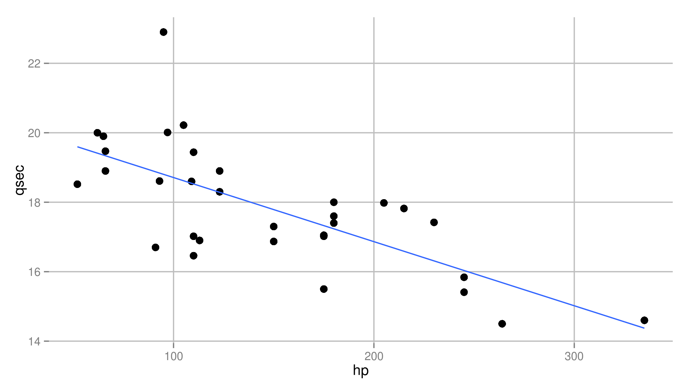

Shiny Application Presentation
===================================
author: Richard Ian Carpenter
date: 16 Jan 2016

Shiny App Introduction
===============================
This Shiny App was developed as a result of a series of discussions that took place in the forums of the Statistical Inference and Machine Learning courses.  The unresoved issue was focused on selecting model parameters and finding the "best" model.

- The app uses the `mtcars` dataset and allows the user to define both the dependent and independent variables in a linear model (`lm()`) regression.
- The regressions results appear in the same manner as they would if the `summary()` function were used along with the regression.

Shiny App Introduction, continued
========================================
- A plot using the selected variables is also generated, plotting the dependent variable along the y-axis, the independent variable(s) along the x-axis, and the regression line "fitted" among the scatter plot of points. 
- An example of the output is contained in the remaining slides.
- Additional comments and some unused code are commented out in the `ui.R` and `server.R` files.
- My Shiny app can be found here: <br>https://richard-ian-carpenter.shinyapps.io/CourseProj/
- My GitHub repository can be found here: <br>https://github.com/richard-ian-carpenter/CourseProj


Example Regression Table Output
========================================================
Here is an example of a regression using the `mtcars` dataset:
<small><small>

```

Call:
lm(formula = qsec ~ hp, data = mtcars)

Residuals:
    Min      1Q  Median      3Q     Max 
-2.1766 -0.6975  0.0348  0.6520  4.0972 

Coefficients:
             Estimate Std. Error t value Pr(>|t|)    
(Intercept) 20.556354   0.542424  37.897  < 2e-16 ***
hp          -0.018458   0.003359  -5.495 5.77e-06 ***
---
Signif. codes:  0 '***' 0.001 '**' 0.01 '*' 0.05 '.' 0.1 ' ' 1

Residual standard error: 1.282 on 30 degrees of freedom
Multiple R-squared:  0.5016,	Adjusted R-squared:  0.485 
F-statistic: 30.19 on 1 and 30 DF,  p-value: 5.766e-06
```
</small></small>

Example Regression Plot Output
========================================================
Here is the example regression plot output, created using **ggplot2**:


